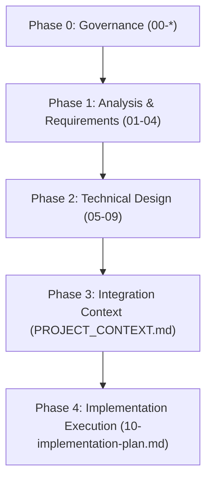

# 00. Documentation Structure

**Project Name:** Personal Income & Expense Management System (ระบบจัดการรายรับ-รายจ่ายส่วนบุคคล)  
**Document Version:** 1.0.0  
**Phase:** Phase 0 - Governance & Documentation Standards  
**Author:** Technical Writer & Software Project Manager  

---

## 1. โครงสร้างโฟลเดอร์ `docs/`
ภาพรวมการจัดเก็บเอกสารทั้งหมดของโปรเจกต์:

```text
docs/
├── planning/       # เอกสารวิเคราะห์ วางแผน และข้อกำหนดระบบ
├── testing/        # เอกสารแผนการทดสอบ และรายงานผลการทดสอบ
└── deployment/     # เอกสารขั้นตอนการประกอบร่าง และการ Deploy บน Production
```

## 2. โครงสร้าง `docs/planning/`
โฟลเดอร์สำหรับเก็บเอกสารสถาปัตยกรรม ข้อกำหนด และแผนการพัฒนา:

```text
docs/planning/
├── 00-tech-stack-decision.md
├── 00-ai-working-rules.md
├── 00-documentation-structure.md
├── 01-system-overview.md
├── 02-requirements.md
├── 03-roles-permissions.md
├── 04-complaint-workflow.md
├── 05-database-design.md
├── 06-api-contract.md
├── 07-frontend-pages.md
├── 08-dashboard-report-notification.md
├── 09-project-docker-architecture.md
├── PROJECT_CONTEXT.md
└── 10-implementation-plan.md
```

## 3. โครงสร้าง `docs/testing/`
โฟลเดอร์สำหรับเก็บแผนการทดสอบและผลการทดสอบ:

```text
docs/testing/
├── test-plan.md            # แผนการทดสอบระบบภาพรวม
├── unit-test-cases.md      # กรณีทดสอบระดับ Unit Test
├── api-test-cases.md       # กรณีทดสอบ API Endpoints
└── e2e-test-cases.md       # กรณีทดสอบ End-to-End User Flow
```

## 4. โครงสร้าง `docs/deployment/`
โฟลเดอร์สำหรับเก็บเอกสารการ Deploy และตั้งค่า Infrastructure:

```text
docs/deployment/
├── railway-setup.md        # ขั้นตอนการตั้งค่า Deploy บน Railway
├── environment-variables.md# รายการตัวแปรสภาพแวดล้อมทั้งหมด
└── production-checklist.md  # รายการตรวจสอบก่อนเปิดใช้งานจริง (Go-Live Checklist)
```

## 5. รายชื่อไฟล์ Planning และวัตถุประสงค์
รายการเอกสารวางแผนหลักใน `docs/planning/` พร้อมวัตถุประสงค์รายละเอียด:

| ลำดับ | ชื่อไฟล์ | วัตถุประสงค์ของเอกสาร |
| :---: | :--- | :--- |
| 1 | `00-tech-stack-decision.md` | บันทึกการตัดสินใจเลือก Tech Stack, ข้อจำกัด และกรอบสถาปัตยกรรมเบื้องต้น |
| 2 | `00-ai-working-rules.md` | กติกาและข้อบังคับในการทำงานร่วมกับ AI เพื่อควบคุมไม่ให้ข้าม Phase หรือออกนอกขอบเขต |
| 3 | `00-documentation-structure.md` | โครงสร้างเอกสาร ลำดับการสร้าง และกติกาการบันทึกเอกสารของโปรเจกต์ |
| 4 | `01-system-overview.md` | สรุปภาพรวมของระบบ เป้าหมาย ขอบเขตผู้ใช้งาน และคุณค่าทางธุรกิจ |
| 5 | `02-requirements.md` | ข้อกำหนดทางธุรกิจ (Functional & Non-Functional Requirements) |
| 6 | `03-roles-permissions.md` | กำหนดสิทธิ์ของผู้ใช้งาน (User Roles, Scopes, Access Control List) |
| 7 | `04-complaint-workflow.md` | ลำดับขั้นตอนการทำงาน (Workflow Engine/State Diagram) ของกิจกรรมในระบบ |
| 8 | `05-database-design.md` | การออกแบบฐานข้อมูล ER-Diagram, Data Dictionary, Indexes และ Constraints |
| 9 | `06-api-contract.md` | ข้อตกลง API Specification (Endpoints, Request Payload, Response Format, Status Codes) |
| 10 | `07-frontend-pages.md` | การออกแบบหน้าจอ UI/UX, Page Routes, Component Hierarchy และ State Flow |
| 11 | `08-dashboard-report-notification.md` | ข้อกำหนดการคำนวณ Dashboard, สรุปรายงานรายรับ-รายจ่าย และระบบแจ้งเตือน |
| 12 | `09-project-docker-architecture.md` | การออกแบบ Docker Compose, Service Network, Port Mapping และ Volume Strategy |
| 13 | `PROJECT_CONTEXT.md` | สรุปภาพรวมบริบทโปรเจกต์ฉบับรวบยอดสำหรับให้ AI อ่านก่อนเริ่มงาน |
| 14 | `10-implementation-plan.md` | แผนการพัฒนาเรียงตาม Phase พร้อมคำสั่งรัน การทดสอบ และ Acceptance Criteria |

## 6. ลำดับการสร้างไฟล์ (Creation Order)



1. **ลำดับที่ 1 (Governance Setup):**
   - `00-tech-stack-decision.md`
   - `00-ai-working-rules.md`
   - `00-documentation-structure.md`
2. **ลำดับที่ 2 (Requirement Analysis):**
   - `01-system-overview.md`
   - `02-requirements.md`
   - `03-roles-permissions.md`
   - `04-complaint-workflow.md`
3. **ลำดับที่ 3 (Technical & System Design):**
   - `05-database-design.md`
   - `06-api-contract.md`
   - `07-frontend-pages.md`
   - `08-dashboard-report-notification.md`
   - `09-project-docker-architecture.md`
4. **ลำดับที่ 4 (AI Master Context & Execution Plan):**
   - `PROJECT_CONTEXT.md`
   - `10-implementation-plan.md`

## 7. กติกาการตั้งชื่อไฟล์ (Naming Conventions)
* **รูปแบบตัวอักษร:** ใช้ตัวอักษรพิมพ์เล็กทั้งหมด (kebab-case) คั่นด้วยเครื่องหมายขีดกลาง `-`
* **ตัวเลขนำหน้า:** ใช้ตัวเลข 2 หลักนำหน้าไฟล์สถาปัตยกรรม (เช่น `00-`, `01-`, `05-`) เพื่อจัดเรียงลำดับการอ่านตามตรรกะ
* **นามสกุลไฟล์:** ต้องเป็น `.md` เท่านั้น
* **กรณีพิเศษ:** ไฟล์ `PROJECT_CONTEXT.md` ใช้อักษรตัวใหญ่ทั้งหมด เพื่อให้โดดเด่นและทำหน้าที่เป็น Master Reference File

## 8. กติกาการเขียน Markdown (Markdown Style Guide)
* **Heading Hierarchy:** ใช้ `#` สำหรับ Title เพียง 1 ตำแหน่งต่อไฟล์, `##` สำหรับ Main Sections, และ `###` สำหรับ Sub-sections
* **Table Usage:** ใช้ตารางสรุปข้อมูลเชิงเปรียบเทียบ เช่น Port Mapping, API Endpoints, Data Dictionary
* **Alert Blocks:** ใช้ GitHub Alerts (`> [!NOTE]`, `> [!IMPORTANT]`, `> [!WARNING]`) เพื่อเน้นข้อควรระวังสำคัญ
* **Code Blocks:** กำหนดภาษาของ Code block เสมอ เช่น ````bash` ````html` ````json` ````yaml` ````sql`
* **File Links:** ทุกครั้งที่อ้างอิงไฟล์อื่น ให้ทำลิงก์รูปแบบ Markdown Relative Link หรือ Clickable Scheme (`file:///...`)

## 9. วิธีใช้เอกสารเหล่านี้กับ AI ในแต่ละ Phase

| Phase การทำงาน | เอกสารที่ AI ต้องอ่านก่อนเริ่ม | วัตถุประสงค์ในการอ่าน |
| :--- | :--- | :--- |
| **Phase 0: Setup** | `00-ai-working-rules.md`, `00-tech-stack-decision.md` | เข้าใจกติกาและขอบเขตเทคโนโลยีเบื้องต้น |
| **Phase 1: Architecture** | `01-system-overview.md` ถึง `09-project-docker-architecture.md` | ออกแบบข้อกำหนด สคีมา และสัญญา API |
| **Phase 2: Planning** | `PROJECT_CONTEXT.md`, `10-implementation-plan.md` | ตรวจสอบบริบทภาพรวมและอนุมัติแผนการเขียนโค้ด |
| **Phase 3+: Implementation** | `.agents/skills/.../SKILL.md`, `10-implementation-plan.md` | ดำเนินการเขียนโค้ดตาม Phase ที่ได้รับมอบหมายเท่านั้น |
