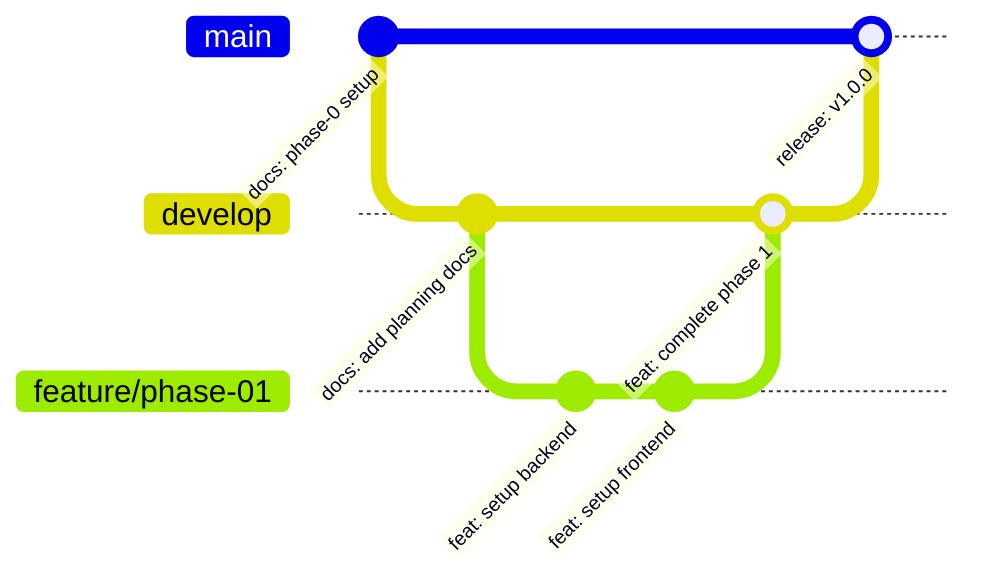

# 00. Git Workflow & Commit Rules

**Project Name:** Personal Income & Expense Management System (ระบบจัดการรายรับ-รายจ่ายส่วนบุคคล)  
**Document Version:** 1.0.0  
**Phase:** Phase 0 - Governance & Version Control Standards  
**Author:** Senior Software Engineer & Git Workflow Consultant  

---

## 1. Branch Strategy
สำหรับโปรเจกต์ขนาดเล็กถึงปานกลางที่พัฒนาด้วย AI แนะนำให้ใช้ **Trunk-Based / Feature-Branch Strategy** ดังนี้:

* **`main` / `master`:** สาขาหลักสำหรับซอร์สโค้ดและเอกสารที่ผ่านการทดสอบและได้รับการอนุมัติเรียบร้อยแล้ว (Production-ready Code & Final Docs)
* **`develop`:** สาขาสำหรับรวบรวมงานระหว่างพัฒนาแต่ละ Phase ก่อน Merge เข้า `main`
* **`feature/[phase-name]`:** (ตัวเลือก) สาขาย่อยสำหรับพัฒนาเฉพาะ Phase เช่น `feature/phase-01-auth`, `feature/phase-02-transactions`



## 2. Commit Convention
โปรเจกต์นี้ใช้มาตรฐาน **Conventional Commits** เพื่อให้ประวัติการแก้ไข (Git History) อ่านง่าย สื่อความหมายชัดเจน และสามารถสืบประวัติจุดย้อนกลับ (Rollback Point) ได้อย่างถูกต้อง

โครงสร้างของ Type ที่อนุญาตให้ใช้:
* **`docs:`** การสร้างหรืออัปเดตเอกสารวางแผน (`docs/planning/`, `README.md`, `SKILL.md`)
* **`feat:`** การเพิ่มฟีเจอร์ใหม่ หรือการพัฒนาโค้ดตาม Phase
* **`fix:`** การแก้ Bug, Error หรือข้อผิดพลาดทางเทคนิค
* **`chore:`** การปรับแต่งการตั้งค่าระบบ, Build Scripts, Docker, `.gitignore`, Dependencies
* **`refactor:`** การปรับแต่งโครงสร้างโค้ดโดยไม่เปลี่ยนแปลงพฤติกรรมของระบบ
* **`style:`** การปรับแต่ง UI Component, CSS, Spacing โดยไม่แก้ Business Logic

## 3. Commit Message Format
รูปแบบของ Commit Message ต้องปฏิบัติตามโครงสร้างมาตรฐาน:

```text
<type>(<scope>): <short description in lowercase>

[optional body providing more context]
```

* **Type:** `docs`, `feat`, `fix`, `chore`, `refactor`, `style`
* **Scope (ถ้ามี):** ระบุส่วนที่แก้ไข เช่น `(phase-0)`, `(backend)`, `(frontend)`, `(db)`, `(docker)`
* **Subject:** ข้อความสั้นภาษาอังกฤษ พิมพ์เล็กทั้งหมด กระชับ ไม่ต้องใส่จุดซ่อนหลัง

## 4. When to Commit
กำหนดจุดสร้าง Commit เพื่อให้มี Checkpoint ในการย้อนกลับ (Safe Checkpoint) ที่ชัดเจน:

1. **หลังจบแต่ละ Planning Step:** เมื่อเขียนเอกสารวางแผนแต่ละฉบับเสร็จสมบูรณ์
2. **หลังจบแต่ละ Implementation Phase:** เมื่อพัฒนาโค้ดและผ่าน Acceptance Criteria Checklist ของ Phase นั้นเรียบร้อย
3. **หลังแก้ไข Bug สำคัญ:** เมื่อแก้ Bug หรือ Error ที่ทำให้ระบบล่มหรือรันไม่ผ่านเรียบร้อย
4. **ก่อนเริ่มงาน Phase ใหม่:** เพื่อให้มั่นใจว่า Working Directory สะอาด (`working tree clean`)

## 5. Commit per Planning Step
ตัวอย่างมาตรฐานการ Commit เมื่อจัดทำเอกสารใน Phase 0 & Phase 1:

* `docs: add tech stack decision`
* `docs: add AI working rules`
* `docs: add documentation structure`
* `docs: add git workflow`
* `docs: add system overview`
* `docs: add requirements specification`
* `docs: add database design`
* `docs: add api contract`
* `docs: add project context`
* `docs: add implementation plan`

## 6. Commit per Implementation Phase
ตัวอย่างมาตรฐานการ Commit เมื่อพัฒนาโค้ดเสร็จตามแต่ละ Phase:

* `feat: complete phase 1 project setup`
* `feat: complete phase 2 database initialization and connection`
* `feat: complete phase 3 backend core api implementation`
* `feat: complete phase 4 frontend dashboard and forms integration`
* `feat: complete phase 5 end-to-end integration and polish`

## 7. Commit after Bug Fix
ตัวอย่างมาตรฐานการ Commit หลังแก้ไขปัญหา/ข้อผิดพลาด:

* `fix: resolve backend database connection timeout`
* `fix: correct mysql host port mapping in docker compose`
* `fix: solve frontend vite proxy CORS issue`
* `fix: handle null category id in transaction post endpoint`

## 8. Rollback Strategy
เมื่อเกิดข้อผิดพลาดรุนแรงจากการทำงานของ AI หรือโค้ดใน Phase ปัจจุบันพังจนไม่สามารถแก้ไขได้ ให้ใช้กลยุทธ์ย้อนกลับดังนี้:

1. **ตรวจสอบจุด Checkpoint (Git Log):**
   ```bash
   git log --oneline -n 10
   ```
2. **ย้อนกลับชั่วคราวเพื่อตรวจสอบ (Soft Check):**
   ```bash
   git checkout <commit-hash>
   ```
3. **ยกเลิกการเปลี่ยนแปลงใน Phase ปัจจุบัน ย้อนกลับไปยังจุด Commit ล่าสุดที่ทำงานได้:**
   ```bash
   git reset --hard <last-stable-commit-hash>
   ```
4. **กรณีต้องการยกเลิกเฉพาะไฟล์:**
   ```bash
   git checkout <last-stable-commit-hash> -- path/to/file
   ```

## 9. Files that Should Be Committed
ไฟล์ที่**ต้อง**อยู่ในการติดตามของ Git:

* ซอร์สโค้ดโปรเจกต์ (`backend/`, `frontend/`, `mysql/`)
* เอกสารวางแผนทั้งหมด (`docs/planning/`, `docs/testing/`, `docs/deployment/`)
* ไฟล์คู่มือ AI Skill (`.agents/skills/damrongdham-dev/SKILL.md`)
* ไฟล์ตั้งค่าโปรเจกต์ (`docker-compose.yml`, `Dockerfile.dev`, `vite.config.js`, `package.json`)
* ตัวอย่างไฟล์คอนฟิก (`.env.example`)
* เอกสารคำแนะนำโปรเจกต์ (`README.md`, `.gitignore`)

## 10. Files that Should Not Be Committed
ไฟล์ที่**ห้าม** Commit ลง Git โดยเด็ดขาด:

* ❌ ไฟล์เก็บค่าความลับและ Credentials จริง (`.env`, `.env.local`, `.env.production`)
* ❌ โฟลเดอร์ติดตั้ง Dependencies (`node_modules/`, `backend/node_modules/`, `frontend/node_modules/`)
* ❌ ผลลัพธ์การ Build (`frontend/dist/`, `frontend/.vite/`, `build/`)
* ❌ Log files และไฟล์ข้อมูลชั่วคราว (`*.log`, `npm-debug.log*`, `yarn-error.log*`)
* ❌ ฐานข้อมูลขนาดใหญ่หรือไฟล์ไดเรกทอรีข้อมูลของ MySQL (`mysql_data/`, `*.sqlite`, `*.db`)
* ❌ ไฟล์ระดับระบบปฏิบัติการ (`.DS_Store`, `Thumbs.db`, `.idea/`, `.vscode/`)

## 11. Suggested `.gitignore` Rules
ตัวอย่างโครงสร้างไฟล์ `.gitignore` ที่แนะนำสำหรับโปรเจกต์นี้:

```text
# Node dependencies
node_modules/
backend/node_modules/
frontend/node_modules/

# Environment & secret variables
.env
.env.local
.env.development.local
.env.test.local
.env.production.local

# Build outputs
frontend/dist/
frontend/.vite/

# Logs
*.log
npm-debug.log*
yarn-debug.log*

# Database storage
mysql_data/

# OS & Editor metadata
.DS_Store
Thumbs.db
.vscode/
.idea/
```

## 12. Example Commit Messages
สรุปประวัติ Commit ตัวอย่างที่เป็นระเบียบเรียบร้อยตามมาตรฐานโปรเจกต์:

```text
chore: update docker compose configuration
fix: resolve backend database connection
feat: complete phase 1 project setup
docs: add implementation plan
docs: add project context
docs: add api contract
docs: add database design
docs: add system overview
docs: add AI working rules
docs: add tech stack decision
```
