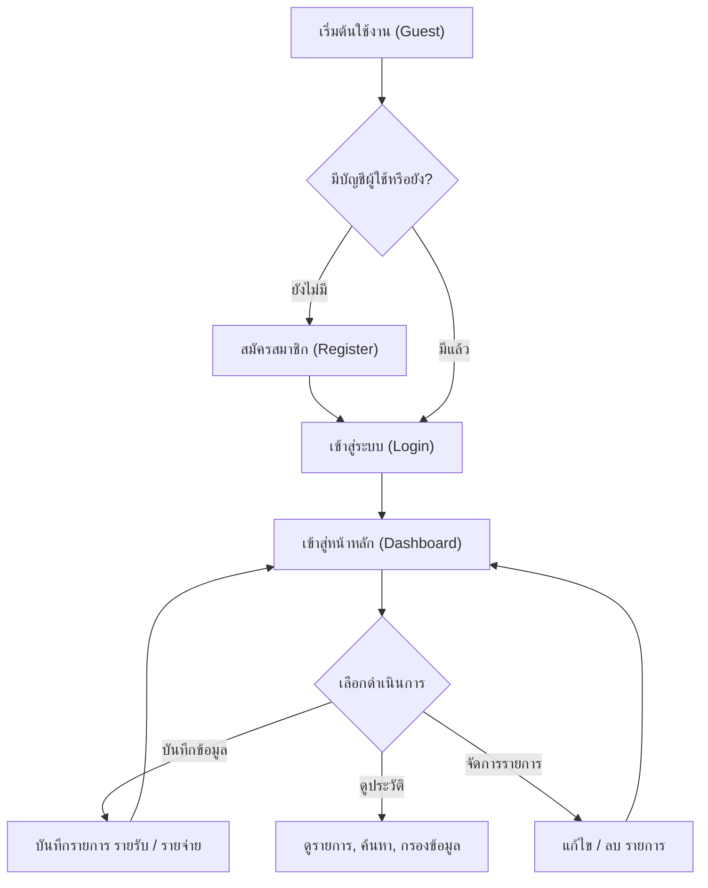
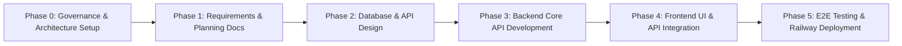

# 01. System Overview Document

**Project Name:** Personal Income & Expense Management System (ระบบจัดการรายรับ-รายจ่ายส่วนบุคคล)  
**Document Version:** 1.0.0  
**Phase:** Phase 1 - Requirements & Architecture Analysis  
**Authors:** Business Analyst, Software Architect, Project Manager & UX/UI Designer  

---

## 1. System Overview (ภาพรวมของระบบ)
**Personal Income & Expense Management System** เป็น Web Application สำหรับการบริหารจัดการการเงินส่วนบุคคล มีวัตถุประสงค์เพื่อช่วยให้ผู้ใช้งานสามารถบันทึก รายรับ (Income) และ รายจ่าย (Expense) ในชีวิตประจำวันได้อย่างสะดวก รวดเร็ว และเป็นระเบียบ ระบบมาพร้อม Dashboard สรุปสถิติ กราฟวิเคราะห์พฤติกรรมการใช้จ่าย รายงานแยกตามหมวดหมู่ และฟังก์ชันการค้นหากรองข้อมูลย้อนหลัง ทำให้ผู้ใช้งานเห็นภาพรวมสถานะทางการเงิน วางแผนงบประมาณ และควบคุมค่าใช้จ่ายได้อย่างมีประสิทธิภาพ

---

## 2. Problem Statement (ปัญหาที่ต้องการแก้ไข)
จากการวิเคราะห์พฤติกรรมผู้ใช้งาน พบปัญหาหลักในการจัดการการเงินส่วนบุคคลดังนี้:

1. **Lack of Expense Tracking (จำไม่ได้ว่าใช้เงินไปกับอะไรบ้าง):** ผู้ใช้มักลืมรายการใช้จ่ายย่อยๆ ระหว่างวัน ทำให้เงินสดหรือเงินในบัญชีลดลงโดยไม่ทราบสาเหตุที่ชัดเจน
2. **Inefficient Manual Recording (บันทึกข้อมูลแบบดั้งเดิมล้มเหลว):** การใช้กระดาษ สมุด หรือแอปจดบันทึกทั่วไป (เช่น Note/Excel) ทำให้จัดหมวดหมู่อยาก ค้นหาย้อนหลังยุ่งยาก และไม่แสดงภาพรวมอัตโนมัติ
3. **No Financial Overview (ไม่เห็นภาพรวมทางการเงิน):** ผู้ใช้ไม่ทราบยอดสรุปรายรับ-รายจ่ายรวมในแต่ละเดือน ทำให้คำนวณเงินคงเหลือสุทธิผิดพลาด
4. **Unaware of Expense Drivers (ไม่ทราบหมวดหมู่ที่เป็นจุดรั่วไหลทางการเงิน):** ผู้ใช้ไม่เห็นว่าตนเองใช้เงินไปกับหมวดหมู่ใดมากที่สุด (เช่น อาหาร, ช้อปปิ้ง, ความบันเทิง) ทำให้ไม่สามารถปรับลดรายจ่ายที่ไม่จำเป็นได้
5. **Difficult Budget Planning (วางแผนและควบคุมค่าใช้จ่ายได้ยาก):** ขาดข้อมูลสถิติย้อนหลังสำหรับนำมาวางแผนการเงินหรือกำหนดงบประมาณในอนาคต

---

## 3. Business Goals (เป้าหมายทางธุรกิจและผลลัพธ์ที่คาดหวัง)
* **Systematic Tracking:** ช่วยให้ผู้ใช้บันทึกรายรับ-รายจ่ายได้อย่างสะดวกรวดเร็ว ครบถ้วน และเป็นหมวดหมู่
* **Financial Visibility:** ช่วยให้ผู้ใช้เห็นภาพรวมสถานะทางการเงิน (ยอดรวมรายรับ, รายจ่าย, เงินคงเหลือ) แบบ Real-time
* **Spending Behavior Analysis:** แสดงสถิติ กราฟเปรียบเทียบ และสัดส่วนการใช้จ่ายตามหมวดหมู่ เพื่อวิเคราะห์พฤติกรรมการเงิน
* **Budget Planning Support:** ให้ข้อมูลเชิงลึก (Insights) ที่ช่วยให้ผู้ใช้วางแผนและควบคุมงบประมาณได้อย่างมีประสิทธิภาพ

---

## 4. Target Users (กลุ่มผู้ใช้เป้าหมาย)
* **นักเรียน / นักศึกษา:** ต้องการบันทึกรายรับจากผู้ปกครอง/งานพิเศษ และควบคุมค่าใช้จ่ายประจำวัน เช่น ค่าเรียน ค่าอาหาร ค่าเดินทาง
* **คนทำงาน / พนักงานบริษัท:** ต้องการบริหารจัดการเงินเดือน บันทึกรายจ่ายประจำ (เช่น ค่าเช่าห้อง, ค่าสาธารณูปโภค) และติดตามเงินออม
* **บุคคลทั่วไป:** ผู้ที่ต้องการเครื่องมือในการวางแผนทางการเงินส่วนบุคคล ลดรายจ่ายไม่จำเป็น และสร้างวินัยทางการเงิน

---

## 5. User Roles & Access Scope (บทบาทผู้ใช้งานและสิทธิ์การเข้าถึง)
ระบบออกแบบให้เน้นการใช้งานส่วนบุคคล (Personal Multi-tenant via Row-Level Data Isolation):

| Role | Description | Access Rights & Scope |
| :--- | :--- | :--- |
| **Guest / Visitor** | ผู้เยี่ยมชมเว็บที่ยังไม่ได้เข้าสู่ระบบ | เข้าถึงได้เฉพาะหน้า Welcome, Login, และ Register |
| **Authenticated User** | ผู้ใช้งานทั่วไปที่ผ่านการลงทะเบียนและเข้าสู่ระบบ | เข้าถึงและจัดการข้อมูลทางการเงิน (รายรับ, รายจ่าย, หมวดหมู่, Dashboard, โปรไฟล์) **ของตนเองเท่านั้น** ไม่สามารถมองเห็นหรือแก้ไขข้อมูลของผู้ใช้อื่นได้ |

---

## 6. Core Features (ฟีเจอร์หลักของระบบ)

### 6.1 ระบบสมาชิกและการยืนยันตัวตน (Authentication & User Profile)
- ลงทะเบียนสมาชิกใหม่ (Register) ด้วย Email และ Password
- เข้าสู่ระบบ (Login) และ ออกจากระบบ (Logout)
- ดูและแก้ไขข้อมูลส่วนตัว (Edit Profile)

### 6.2 ระบบจัดการรายรับ (Income Management)
- เพิ่มรายการรายรับ (ระบุ จำนวนเงิน, วันที่, รายละเอียด/หมายเหตุ, หมวดหมู่รายรับ)
- แก้ไขรายการรายรับ
- ลบรายการรายรับ

### 6.3 ระบบจัดการรายจ่าย (Expense Management)
- เพิ่มรายการรายจ่าย (ระบุ จำนวนเงิน, วันที่, รายละเอียด/หมายเหตุ, หมวดหมู่รายจ่าย)
- แก้ไขรายการรายจ่าย
- ลบรายการรายจ่าย

### 6.4 ระบบศูนย์รวมข้อมูลทางการเงิน (Dashboard & Analytics)
- การ์ดสรุปยอดเงิน: รายรับรวม, รายจ่ายรวม, และ ยอดเงินคงเหลือสุทธิ (Net Balance)
- แผนภูมิวงกลม/โดนัท (Donut Chart) แสดงสัดส่วนรายจ่ายแยกตามหมวดหมู่
- แผนภูมิแท่ง/เส้น (Bar/Line Chart) แสดงแนวโน้มรายรับ-รายจ่าย รายวัน และ รายเดือน

### 6.5 ระบบประวัติรายการ ค้นหา และกรองข้อมูล (History, Search & Filter)
- แสดงประวัติรายการรายรับ-รายจ่ายทั้งหมด เรียงลำดับตามวันที่ (ล่าสุดขึ้นก่อน)
- ค้นหารายการตามชื่อ/รายละเอียด (Text Search)
- กรองตามประเภท (ทั้งหมด / รายรับ / รายจ่าย)
- กรองตามหมวดหมู่ (Category Filter)
- กรองตามช่วงเวลา (Custom Date Range Picker: วันนี้, 7 วันล่าสุด, เดือนนี้, เลือกช่วงวันที่)

### 6.6 ระบบหมวดหมู่รายการ (Category Management)
- แยกหมวดหมู่มาตรฐานสำหรับรายรับ (เช่น เงินเดือน, ฟรีแลนซ์, โบนัส, การลงทุน)
- แยกหมวดหมู่มาตรฐานสำหรับรายจ่าย (เช่น อาหารและเครื่องดื่ม, ค่าเดินทาง, ค่าที่พัก/สาธารณูปโภค, ช้อปปิ้ง, ความบันเทิง)

---

## 7. Preliminary Functional Requirements (ข้อกำหนดเชิงฟังก์ชันเบื้องต้น)
* **FR-01 (Auth):** ระบบต้องสามารถตรวจสอบความถูกต้องของอีเมลและรหัสผ่านในการเข้าสู่ระบบได้
* **FR-02 (Data Security):** ระบบต้องแยกข้อมูลของผู้ใช้งานแต่ละคนอย่างเด็ดขาด (User-level Data Isolation)
* **FR-03 (Transaction CRUD):** ระบบต้องรองรับการ สร้าง อ่าน แก้ไข และลบ (CRUD) รายการรายรับและรายจ่ายได้
* **FR-04 (Validation):** ระบบต้องตรวจสอบจำนวนเงินให้เป็นตัวเลขมากกว่า 0 และวันที่ต้องมีความถูกต้อง
* **FR-05 (Dashboard Calculation):** ระบบต้องคำนวณและอัปเดตยอดคงเหลือ (รายรับรวม - รายจ่ายรวม) อัตโนมัติเมื่อมีการเปลี่ยนแปลงรายการ
* **FR-06 (Filtering):** ระบบต้องสามารถแสดงผลรายการตามเงื่อนไขการกรอง (ประเภท, หมวดหมู่, ช่วงวันที่) ได้อย่างถูกต้อง

---

## 8. Preliminary Non-Functional Requirements (ข้อกำหนดที่ไม่ใช่ฟังก์ชันเบื้องต้น)
* **NFR-01 (Performance):** หน้า Dashboard และรายการต้องโหลดและแสดงผลภายในเวลาไม่เกิน 2 วินาที
* **NFR-02 (Security):** รหัสผ่านของผู้ใช้ต้องถูก Hash ด้วยอัลกอริทึมที่ปลอดภัย (เช่น bcrypt) ก่อนบันทึก และการสื่อสารต้องผ่าน HTTPS
* **NFR-03 (Usability & Design):** อินเทอร์เฟซต้องออกแบบสไตล์ Modern Glassmorphism/MUI 5 สวยงาม ใช้งานง่าย ปรับแต่ง Responsive รองรับการใช้งานผ่าน Desktop, Tablet และ Mobile Browser
* **NFR-04 (Reliability & Health):** ระบบต้องทำ Container Healthcheck และทำงานต่อเนื่องบน Docker Compose โดยไม่มีขัดข้อง

---

## 9. System Scope (ขอบเขตของระบบในระยะนี้)
- เป็น Web Application พัฒนาด้วย React 18, Vite 5, MUI 5, Node.js 20, Express 4 และ MySQL 8
- รองรับระบบสมาชิกเดี่ยวและการแยกข้อมูลตาม User ID
- บันทึก จัดการ ค้นหา และสรุปผลข้อมูลรายรับ-รายจ่ายย้อนหลัง
- แสดง Dashboard และกราฟวิเคราะห์ประจำวัน/เดือน
- รันบน Docker Compose สำหรับพัฒนา และรองรับ Deployment ขึ้น Railway

---

## 10. Out of Scope (ขอบเขตที่ไม่รวมในระยะนี้)
- ❌ การเชื่อมต่อ API อัตโนมัติกับธนาคารหรือสถาบันการเงิน (Bank API Auto-Sync)
- ❌ การทำธุรกรรมทางการเงินจริง (No Real Payment / Transfer / Wallet Engine)
- ❌ ระบบการลงทุน การคำนวณหุ้น พันธบัตร หรือคริปโทเคอร์เรนซี
- ❌ ระบบบัญชีและภาษีสำหรับองค์กรหรือนิติบุคคล (Business Accounting / VAT / WHT)
- ❌ ระบบสแกนใบเสร็จด้วย AI/OCR (วางแผนเป็นฟิวเจอร์ในอนาคต)

---

## 11. Main User Flow (ลำดับขั้นตอนการใช้งานหลัก)

---

## 12. Main Pages / Screen List (รายการหน้าจอหลัก)
1. **Welcome / Login Page:** หน้าเข้าสู่ระบบ สลับฟอร์มสมัครสมาชิก (Register)
2. **Dashboard Page (Main Page):** หน้าหลักแสดงการ์ดสรุปยอดเงิน, กราฟสถิติรายรับ-รายจ่าย และสัดส่วนหมวดหมู่
3. **Transaction History & Management Page:** หน้าแสดงประวัติรายการทั้งหมด พร้อมฟอร์มค้นหา, ตัวกรองช่วงวันที่/หมวดหมู่ และปุ่มจัดการ (Add/Edit/Delete Modal)
4. **Categories Page:** หน้าดูหมวดหมู่รายรับ-รายจ่ายทั้งหมด
5. **Profile Page:** หน้าจัดการข้อมูลส่วนตัวและเปลี่ยนรหัสผ่าน

---

## 13. High-Level System Architecture Overview (การทำงานภาพรวม)
* **Frontend Layer (React 18 + Vite 5 + MUI 5):** ทำหน้าที่แสดงผล UI แบบ Single Page Application (SPA), รับข้อมูลจากผู้ใช้, ส่งคำขอ API ผ่าน Axios/Fetch, และเรนเดอร์กราฟสถิติ
* **Backend API Layer (Node.js 20 + Express 4):** ทำหน้าที่เป็น RESTful API รับ-ส่งข้อมูล JSON, ตรวจสอบสิทธิ์การเข้าถึง (Authentication/Authorization), ตรวจสอบความถูกต้องของข้อมูล (Validation), และประมวลผล Business Logic
* **Database Layer (MySQL 8):** ทำหน้าที่จัดเก็บข้อมูลผู้ใช้, หมวดหมู่ และรายการรายรับ-รายจ่าย โดยมี FK Constraints และ Indexes เพื่อความรวดเร็ว
* **Container Layer (Docker Compose):** จำลองสภาพแวดล้อมทุก Service (`frontend`, `backend`, `db`, `phpmyadmin`) บน Custom Bridge Network เดียวกัน

---

## 14. Key Decisions & Open Questions (ข้อเสนอแนะและประเด็นที่ต้องตัดสินใจ)

### Key Architectural Decisions Already Made
- **Port Strategy:** ใช้ Backend Port `5001` เพื่อหลีกเลี่ยงข้อขัดแย้งกับ AirPlay บน macOS (Port 5000)
- **Deployment Model:** ใช้ Single-container Multi-stage Dockerfile สำหรับ Railway
- **Security Scope:** ข้อมูลผู้ใช้ทุกคนแยกเด็ดขาดผ่าน `user_id` ในทุก Query

### Open Questions (ประเด็นรอการวิเคราะห์ในขั้นตอนถัดไป)
> [!IMPORTANT]
> 1. **Custom Category Feature:** ผู้ใช้ควรสามารถ เพิ่ม/แก้ไข/ลบ หมวดหมู่ของตนเองได้ด้วย หรือให้ใช้เฉพาะหมวดหมู่มาตรฐานของระบบก่อนในเวอร์ชันแรก?
> 2. **Recurring Transactions:** ในระยะแรกควรมีฟีเจอร์ตั้งค่ารายการประจำอัตโนมัติ (เช่น จ่ายค่าห้องทุกวันที่ 1) หรือไม่?
> 3. **Export Data:** ควรมีฟังก์ชันส่งออกข้อมูลเป็น CSV/Excel ในเวอร์ชันแรกหรือไม่?

---

## 15. System Development Phase Plan (แผนการพัฒนาระบบ)

* **Phase 0:** Governance & Setup (ทำเสร็จสิ้นแล้ว)
* **Phase 1:** Requirements & System Overview Planning (กำลังดำเนินงาน ณ ปัจจุบัน)
* **Phase 2:** Database Schema Design & API Contract Specification
* **Phase 3:** Backend Development & Database Initialization
* **Phase 4:** Frontend MUI Development & State Integration
* **Phase 5:** Testing, Refactoring, & Railway Single-container Deployment
