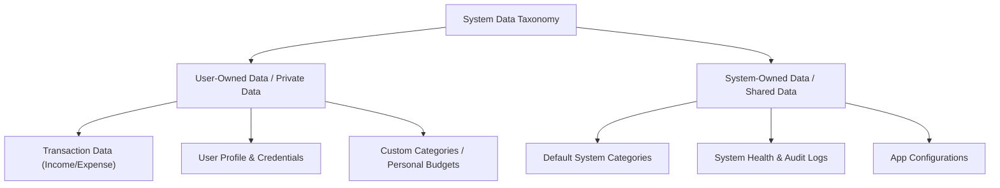

# 03. User Roles & Permissions Document

**Project Name:** Personal Income & Expense Management System (ระบบจัดการรายรับ-รายจ่ายส่วนบุคคล)  
**Document Version:** 1.0.0  
**Phase:** Phase 1 - Access Control & Security Specification  
**Authors:** Senior Software Architect, Security Consultant & Business Analyst  

---

## 1. Overview
เอกสารฉบับนี้จัดทำขึ้นเพื่อกำหนดกรอบสิทธิ์การใช้งาน (Access Control Model), บทบาทผู้ใช้งาน (User Roles), เมทริกซ์สิทธิ์ (Permission Matrix) และกฎการเข้าถึงข้อมูล (Data Access Rules) ของ **Personal Income & Expense Management System** 

เนื่องจากระบบนี้เป็น Web Application สำหรับการบริหารจัดการการเงินส่วนบุคคล (Personal Financial Application) หลักการสำคัญที่สุดด้านความปลอดภัยและการปกป้องข้อมูลส่วนบุคคล (Data Privacy) คือ **"User-Level Data Isolation"** ข้อมูลทางการเงินของผู้ใช้งานแต่ละคนถือเป็นข้อมูลส่วนบุคคลที่เป็นความลับ (Private Data) ผู้ใช้แต่ละคนจะต้องเข้าถึง แก้ไข หรือมองเห็นได้เฉพาะข้อมูลของตนเองเท่านั้น โดยระบบไม่อนุญาตให้มีการเข้าถึงข้อมูลข้ามบัญชี (Cross-account data access) โดยเด็ดขาด

---

## 2. Role Definitions (การกำหนดบทบาทผู้ใช้งาน)

การวิเคราะห์บทบาทผู้ใช้งานในระบบแบ่งออกเป็น 2 บทบาทหลัก ดังนี้:

### 2.1 บทบาทที่สเปกไว้สำหรับ MVP
1. **User (ผู้ใช้งานทั่วไป):**
   - เป็นกลุ่มผู้ใช้งานหลักของระบบ (เช่น นักเรียน นักศึกษา พนักงานบริษัท หรือบุคคลทั่วไป)
   - มีสิทธิ์เต็มในการจัดการข้อมูลทางการเงิน (รายรับ รายจ่าย หมวดหมู่ โปรไฟล์) **เฉพาะของตนเอง**
   - สามารถเข้าถึง Dashboard สรุปผล รายงาน และฟังก์ชันการค้นหากรองข้อมูลของตนเองได้

2. **Guest / Anonymous User (ผู้เยี่ยมชม):**
   - ผู้ใช้งานที่ยังไม่ได้เข้าสู่ระบบ
   - เข้าถึงได้เฉพาะหน้า Welcome, หน้าลงทะเบียน (Register), และหน้าเข้าสู่ระบบ (Login)

### 2.2 การวิเคราะห์ความจำเป็นของบทบาท Admin (ผู้ดูแลระบบ)
* **ข้อสรุปการวิเคราะห์:** สำหรับระยะ MVP (Minimum Viable Product) **ไม่มีความจำเป็นต้องมีบทบาท Admin ในระดับแอปพลิเคชัน (Application Level Admin)** เนื่องจากระบบนี้เน้นการใช้งานส่วนบุคคลโดยตรง ไม่ใช่ระบบการจัดการองค์กรหรือ Multi-tenant B2B 
* **ข้อกำหนดสำหรับ Admin ในอนาคต (Future Scope / System Admin):** หากในอนาคตมีความจำเป็นต้องมี Admin สำหรับดูแลระบบ Infrastructure ให้กำหนดขอบเขตดังนี้:
  - Admin มีสิทธิ์เฉพาะการจัดการระบบภาพรวม (System Administration) เช่น ดู System Health, ดูจำนวนผู้ใช้งานรวม, หรือปิดปรับปรุงระบบ
  - **Admin ห้ามมีสิทธิ์ดู แก้ไข ลบ หรือเข้าถึงรายการรายรับ-รายจ่ายของผู้ใช้งาน โดยเด็ดขาด** (ปฏิบัติตามกฎหมาย PDPA / Data Privacy Policy)

---

### ตารางสรุป Role Definitions

| Role | คำอธิบายบทบาท | สิทธิ์ที่ทำได้ | หน้าจอที่เข้าถึงได้ | ข้อมูลที่มองเห็นได้ | ข้อจำกัดของ Role |
| :--- | :--- | :--- | :--- | :--- | :--- |
| **Guest** | ผู้เยี่ยมชมเว็บที่ยังไม่ได้ยืนยันตัวตน | ลงทะเบียน, เข้าสู่ระบบ | Welcome, Register, Login | เฉพาะข้อมูลสาธารณะในหน้า Welcome | ห้ามเข้าถึงหน้า Dashboard หรือ API ข้อมูลการเงินทั้งหมด |
| **User** | ผู้ใช้งานทั่วไปที่เข้าสู่ระบบสำเร็จ | จัดการโปรไฟล์, บันทึก/แก้ไข/ลบ รายรับ-รายจ่าย, ดู Dashboard | Dashboard, Transactions, Categories, Profile | ข้อมูลโปรไฟล์ และรายการการเงิน **ของตนเองเท่านั้น** | ห้ามดู/แก้ไข/ลบ ข้อมูลของผู้ใช้อื่น และห้ามเข้าถึงส่วนจัดการระบบ |
| **Admin** *(Future Scope)* | ผู้ดูแลระบบในระดับ Infrastructure | ตรวจสอบ System Health, จัดการระบบภาพรวม | System Admin Dashboard | สถิติภาพรวมระบบ (เช่น จำนวน User รวม) | **ห้ามเข้าถึงข้อมูลรายการรายรับ-รายจ่ายส่วนบุคคลของผู้ใช้ทุกคน** |

---

## 3. Role & Permission Matrix (เมทริกซ์สิทธิ์การใช้งาน)

สัญลักษณ์ในตาราง:
- **Allow:** อนุญาตให้ใช้งานได้
- **Allow (Self):** อนุญาตเฉพาะข้อมูลของตนเองเท่านั้น (`user_id` ตรงกับ Token ที่ยึดอยู่)
- **Deny:** ปฏิเสธการเข้าใช้งาน

| Module | Action / Permission | Guest | User | Admin (Future) |
| :--- | :--- | :---: | :---: | :---: |
| **1. Authentication** | Register (สมัครสมาชิก) | Allow | Deny | Deny |
| | Login (เข้าสู่ระบบ) | Allow | Deny | Deny |
| | Logout (ออกจากระบบ) | Deny | Allow | Allow |
| **2. Profile** | View Own Profile (ดูโปรไฟล์ตนเอง) | Deny | Allow (Self) | Allow (Self) |
| | Edit Own Profile (แก้ไขโปรไฟล์ตนเอง) | Deny | Allow (Self) | Allow (Self) |
| | Change Own Password (เปลี่ยนรหัสผ่าน) | Deny | Allow (Self) | Allow (Self) |
| **3. Income** | View Income List (ดูรายการรายรับ) | Deny | Allow (Self) | **Deny** |
| | Create Income (เพิ่มรายการรายรับ) | Deny | Allow (Self) | **Deny** |
| | Edit Income (แก้ไขรายการรายรับ) | Deny | Allow (Self) | **Deny** |
| | Delete Income (ลบรายการรายรับ) | Deny | Allow (Self) | **Deny** |
| **4. Expense** | View Expense List (ดูรายการรายจ่าย) | Deny | Allow (Self) | **Deny** |
| | Create Expense (เพิ่มรายการรายจ่าย) | Deny | Allow (Self) | **Deny** |
| | Edit Expense (แก้ไขรายการรายจ่าย) | Deny | Allow (Self) | **Deny** |
| | Delete Expense (ลบรายการรายจ่าย) | Deny | Allow (Self) | **Deny** |
| **5. Category** | View Default Categories (ดูหมวดหมู่มาตรฐาน) | Deny | Allow | Allow |
| | Manage Custom Categories (จัดการหมวดหมู่ส่วนตัว) | Deny | Allow (Self)* | **Deny** |
| **6. Dashboard** | View Financial Summary (ดูยอดสรุปการเงิน) | Deny | Allow (Self) | **Deny** |
| | View Category Breakdown (ดูสัดส่วนตามหมวดหมู่) | Deny | Allow (Self) | **Deny** |
| | View Financial Trend Charts (ดูกราฟสถิติ) | Deny | Allow (Self) | **Deny** |
| **7. Search & Filter** | Search & Filter Own Transactions | Deny | Allow (Self) | **Deny** |
| **8. Reports** | View / Export Personal Reports | Deny | Allow (Self) | **Deny** |
| **9. Administration**| View System Health & Total User Count | Deny | Deny | Allow |

*\*หมายเหตุ: การจัดการ Custom Categories เป็นส่วนขึ้นอยู่กับข้อตกลงเรื่อง Open Questions ในภายหลัง*

---

## 4. Data Access Rules (โมเดลและกฎการเข้าถึงข้อมูล)

เพื่อความปลอดภัยสูงสุด ระบบใช้หลักการจำแนกประเภทข้อมูลและการเข้าถึงดังนี้:

### 4.1 Data Access Model Taxonomy

### 4.2 Data Classification Matrix

| Data Type | Description | Ownership | Privacy Level | User Access | Admin Access |
| :--- | :--- | :--- | :--- | :--- | :--- |
| **User Profile Data** | อีเมล, รหัสผ่าน (Hash), ชื่อแสดงผล | User Owned | **Private** | Read / Edit (Self) | **Deny** (หรือสิทธิ์ค้นหาเฉพาะเมื่อผู้ร้องขอ) |
| **Financial Transactions** | รายการรายรับ-รายจ่าย, จำนวนเงิน, วันที่, หมายเหตุ | User Owned | **Strictly Private** | Full CRUD (Self) | **STRICTLY DENIED** |
| **Custom Categories** | หมวดหมู่เฉพาะที่ผู้ใช้สร้างเพิ่มเอง | User Owned | **Private** | Full CRUD (Self) | **Deny** |
| **Default Categories** | หมวดหมู่มาตรฐานที่ระบบจัดเตรียมไว้ให้ | System Owned | **Public Shared** | Read Only | Full Control |
| **System Logs** | Log การทำงานของ Server, Healthcheck | System Owned | **Internal Only** | Deny | Read Only |

---

## 5. Role-specific Restrictions (ข้อจำกัดเฉพาะบทบาท)

1. **User Isolation Enforcement:**
   - ทุกคำขอ API (Request) ที่เกี่ยวกับรายการทางการเงิน ต้องถูกตรวจสอบ Token และบังคับกรองข้อมูลด้วย `WHERE user_id = :current_user_id` ในระดับ Backend Database Query เสมอ
   - ผู้ใช้ไม่สามารถระบุ `user_id` ของผู้อื่นใน Request Body/Params เพื่ออ่านหรือแก้ไขข้อมูลได้

2. **Admin Prohibition (ข้อห้ามของ Admin):**
   - ห้ามไม่ให้บทบาท Admin มีปุ่ม หน้าจอ หรือ API Endpoints สำหรับดึงรายการรายรับ-รายจ่ายของผู้ใช้งานทุกคนมาดู (No Master Transaction Viewer)
   - ห้าม Admin แก้ไขหรือลบรายการทางการเงินของผู้ใช้ โดยไม่ได้รับคำสั่งอย่างเป็นทางการตามขั้นตอนกฎหมาย

---

## 6. Security Considerations (ข้อพิจารณาด้านความปลอดภัย)

* **Authentication Token:** ใช้ JWT (JSON Web Token) หรือ Secure Session ที่ส่งผ่าน HTTP-Only Cookie เพื่อป้องกันการโจรกรรม Token ผ่าน XSS
* **Row-Level Security Enforcement:** ทุก API Endpoint สำหรับ Transaction ต้องตรวจสอบ Ownership (เจ้าของสิทธิ์) ใน Backend Controller ก่อนทำรายการเสมอ
* **Password Hashing:** ใช้ อัลกอริทึม bcrypt โดยกำหนด Salt Rounds ที่เหมาะสม (เช่น 10-12 rounds)
* **PDPA / GDPR Compliance:** ข้อมูลการเงินถือเป็นข้อมูลส่วนบุคคลอ่อนไหว ห้ามบันทึกข้อมูลบัตรเครดิต รหัสผ่าน หรือข้อมูลธนาคารจริงลงในระบบ

---

## 7. Open Questions & Assumptions (คำถามและสมมติฐาน)

### Assumptions
1. ในเวอร์ชันแรก MVP มีเฉพาะบทบาท **User** และ **Guest** ก็เพียงพอสำหรับการเปิดใช้งานระบบจัดการการเงินส่วนบุคคล
2. ไม่มีการแชร์ข้อมูลทางการเงินระหว่างผู้ใช้ (No Shared Wallet / No Family Account) ในเวอร์ชันแรก

### Open Questions
> [!IMPORTANT]
> 1. **Password Reset Flow:** หากผู้ใช้ลืมรหัสผ่าน ควรมีระบบส่งลิงก์รีเซ็ตรหัสผ่านทางอีเมล (Email Reset Link) หรือไม่?
> 2. **Account Deletion (Right to be Forgotten):** ผู้ใช้ควรมียอมรับการลบบัญชีและลบข้อมูลทางการเงินทั้งหมดของตนเองออกจากระบบอย่างถาวร (Self-service Account Deletion) ในระยะแรกหรือไม่?

---

## 8. Recommendations (ข้อเสนอแนะ)
1. **MVP Scope:** มุ่งเน้นการพัฒนาสิทธิ์สำหรับ **User** ให้รัดกุมและปลอดภัย 100% ก่อน โดยยังไม่ต้องพัฒนาหน้าจอสำหรับ Admin
2. **Backend Validation:** ออกแบบ Middleware ใน Express (เช่น `authenticateToken`) เพื่อสกัดและฉีด `req.user.id` เข้าสู่ทุก Controller ป้องกันการส่ง `user_id` หลอกมาจาก Frontend
