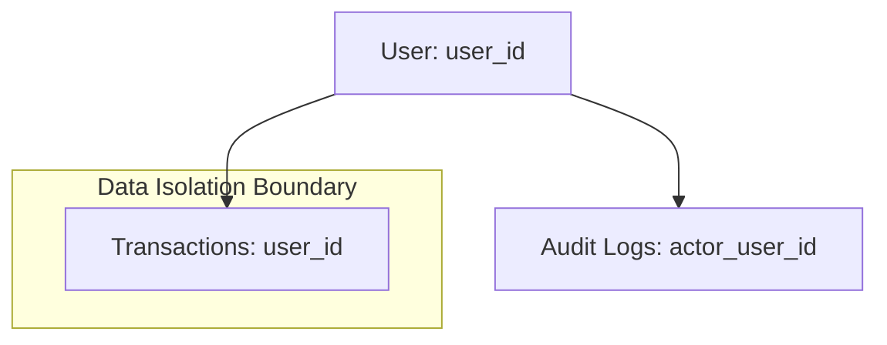

# 05. Database Design Document

**Project Name:** Personal Income & Expense Management System (ระบบจัดการรายรับ-รายจ่ายส่วนบุคคล)  
**Document Version:** 1.0.0  
**Phase:** Phase 2 - Database Architecture Specification  
**Authors:** Senior Database Architect & Backend Architect  

---

## 1. Database Overview
เอกสารฉบับนี้เป็นการออกแบบสถาปัตยกรรมฐานข้อมูล (Database Architecture Design Overview) สำหรับ **Personal Income & Expense Management System** โดยใช้ **MySQL 8.0** เป็นระบบจัดการฐานข้อมูลเชิงสัมพันธ์ (Relational Database Management System - RDBMS) 

การออกแบบมุ่งเน้นการปฏิบัติตามหลักสถาปัตยกรรมฐานข้อมูลที่ดี (Database Best Practices), การรักษาความสัมพันธ์ของข้อมูล (Referential Integrity), การรองรับภาษาไทยเต็มรูปแบบด้วย Charset `utf8mb4` และ Collation `utf8mb4_unicode_ci`, การแยกสิทธิ์เข้าถึงข้อมูลระดับผู้ใช้ (User-Level Data Isolation) และการออกแบบดัชนี (Indexes) ที่มีประสิทธิภาพสูงเพื่อรองรับการคำนวณ Dashboard และรายงานทางการเงิน

---

## 2. Design Principles (หลักการออกแบบฐานข้อมูล)
1. **Data Integrity & Consistency:** ใช้ Foreign Keys และ Constraints เพื่อการันตีความถูกต้องของข้อมูลทุกรายการ
2. **Strict User Data Isolation:** ทุกตารางในระดับ Transaction และ Personal Data ต้องมี `user_id` กำกับเพื่อความปลอดภัยและแยกสิทธิ์ข้อมูลเด็ดขาด
3. **High Performance Indexing:** กำหนด B-Tree Composite Indexes สำหรับการสืบค้น Filter ตามช่วงเวลา ประเภทรายการ และหมวดหมู่
4. **Third Normal Form (3NF) Compliance:** ลดความซ้ำซ้อนของข้อมูล (Data Redundancy) ด้วยการจัดระเบียบฐานข้อมูลระดับ 3NF
5. **Precise Financial Data Types:** ใช้ `DECIMAL(12, 2)` สำหรับตัวเลขจำนวนเงินทั้งหมด ห้ามใช้ Floating-point เพื่อป้องกันทศนิยมคลาดเคลื่อน

---

## 3. Table Classification (การจำแนกประเภทตาราง)

ฐานข้อมูลของระบบแบ่งออกเป็น 4 กลุ่มหลักดังนี้:

| กลุ่มตาราง (Classification) | รายชื่อตาราง (Table Name) | วัตถุประสงค์ (Purpose) |
| :--- | :--- | :--- |
| **Core Tables** | `users` | จัดเก็บข้อมูลบัญชีผู้ใช้งาน สิทธิ์การเข้าถึง และข้อมูลการยืนยันตัวตน |
| **Master Data Tables** | `categories` | จัดเก็บข้อมูลหมวดหมู่มาตรฐานสำหรับรายรับและรายจ่าย |
| **Transaction Tables** | `transactions` | จัดเก็บรายการเคลื่อนไหวทางการเงินทั้งหมด (ทั้ง Income และ Expense) |
| **Log / History Tables** | `audit_logs` | จัดเก็บประวัติการทำธุรกรรมและกิจกรรมสำคัญของระบบ (Audit Trail) |

---

## 4. Core Tables Overview
- **`users`:** ตารางหลักในการจัดเก็บข้อมูลผู้ใช้ทุกคนในระบบ เป็นศูนย์กลางการอ้างอิง `user_id` สำหรับ Data Ownership

## 5. Master Data Tables Overview
- **`categories`:** ตารางจัดเก็บข้อมูลหมวดหมู่มาตรฐาน เช่น เงินเดือน, ฟรีแลนซ์, อาหาร, ค่าเดินทาง มีการระบุประเภท `income` หรือ `expense` พร้อมไอคอนและสีแสดงผล

## 6. Transaction Tables Overview
- **`transactions`:** ตารางรวมสำหรับจัดเก็บรายการทางการเงินทั้งหมด (Single Table Strategy) 
  - *เหตุผลการเลือกใช้ Single Table (ร่วมกันระหว่าง Income/Expense):* การใช้ตารางเดียวพร้อมคอลัมน์ `type ENUM('income', 'expense')` ช่วยให้การสืบค้นประวัติรายการย้อนหลัง (History), การกรองช่วงวันที่ (Date Filter) และการคำนวณ Dashboard สรุปผล ทำได้ง่ายและมีประสิทธิภาพสูงกว่าการแยกตาราง `income_transactions` และ `expense_transactions` ซึ่งต้องใช้ `UNION` ทุกครั้งที่คำนวณ

## 7. Log / History Tables Overview
- **`audit_logs`:** ตารางบันทึกกิจกรรมสำคัญของระบบ (เช่น REGISTER, LOGIN, LOGOUT, CREATE_TRANSACTION, UPDATE_TRANSACTION, DELETE_TRANSACTION) เพื่อความปลอดภัยและการตรวจสอบย้อนหลัง (Auditability)

---

## 8. Field Definitions (แนวทางการกำหนดโครงสร้างฟิลด์)

### 8.1 Table: `users`
- `id`: INT / BIGINT, Auto Increment, NOT NULL (Primary Key)
- `email`: VARCHAR(255), NOT NULL, UNIQUE (อีเมลผู้ใช้งาน)
- `password_hash`: VARCHAR(255), NOT NULL (รหัสผ่านที่ผ่านการ Hash ด้วย bcrypt)
- `display_name`: VARCHAR(100), NOT NULL (ชื่อแสดงผล)
- `created_at`: TIMESTAMP, NOT NULL, Default: CURRENT_TIMESTAMP
- `updated_at`: TIMESTAMP, NOT NULL, Default: CURRENT_TIMESTAMP ON UPDATE CURRENT_TIMESTAMP

### 8.2 Table: `categories`
- `id`: INT, Auto Increment, NOT NULL (Primary Key)
- `name`: VARCHAR(100), NOT NULL (ชื่อหมวดหมู่)
- `type`: ENUM('income', 'expense'), NOT NULL (ประเภทหมวดหมู่)
- `icon`: VARCHAR(50), NULL (ชื่อไอคอน UI)
- `color`: VARCHAR(20), NULL (รหัสสีประจำหมวดหมู่ เช่น `#10B981`)
- `created_at`: TIMESTAMP, NOT NULL, Default: CURRENT_TIMESTAMP

### 8.3 Table: `transactions`
- `id`: BIGINT, Auto Increment, NOT NULL (Primary Key)
- `user_id`: INT / BIGINT, NOT NULL (Foreign Key -> `users.id`)
- `category_id`: INT, NULL (Foreign Key -> `categories.id` ON DELETE SET NULL)
- `title`: VARCHAR(255), NOT NULL (ชื่อรายการ)
- `amount`: DECIMAL(12, 2), NOT NULL (จำนวนเงิน > 0)
- `type`: ENUM('income', 'expense'), NOT NULL (ประเภทรายการ)
- `date`: DATE, NOT NULL (วันที่เกิดรายการ)
- `note`: TEXT, NULL (หมายเหตุ/รายละเอียด)
- `created_at`: TIMESTAMP, NOT NULL, Default: CURRENT_TIMESTAMP
- `updated_at`: TIMESTAMP, NOT NULL, Default: CURRENT_TIMESTAMP ON UPDATE CURRENT_TIMESTAMP

### 8.4 Table: `audit_logs`
- `id`: BIGINT, Auto Increment, NOT NULL (Primary Key)
- `actor_user_id`: INT / BIGINT, NULL (ผู้กระทำกิจกรรม)
- `action`: VARCHAR(50), NOT NULL (ประเภทกิจกรรม เช่น LOGIN, CREATE_TRANSACTION)
- `entity_type`: VARCHAR(50), NOT NULL (ชื่อ Entity เช่น users, transactions)
- `entity_id`: BIGINT, NULL (ID ของ Entity ที่เกี่ยวข้อง)
- `old_value`: JSON / TEXT, NULL (ข้อมูลเดิมก่อนเปลี่ยน)
- `new_value`: JSON / TEXT, NULL (ข้อมูลใหม่หลังเปลี่ยน)
- `ip_address`: VARCHAR(45), NULL (IP ที่ทำรายการ)
- `created_at`: TIMESTAMP, NOT NULL, Default: CURRENT_TIMESTAMP

---

## 9. Primary Keys Design
* **`users.id` & `categories.id`:** ใช้ `INT` / `BIGINT` Auto Increment เพื่อประสิทธิภาพการทำ Indexing ที่รวดเร็ว ใช้พื้นที่จัดเก็บน้อย และง่ายต่อการสร้าง Foreign Key Relationships
* **`transactions.id` & `audit_logs.id`:** ใช้ `BIGINT` Auto Increment เนื่องจากเป็นตารางที่มีอัตราการเติบโตของข้อมูลสูง (High Growth Rate)
* *เหตุผลไม่ใช้ UUID ในระยะ MVP:* UUID (128-bit) มีขนาดใหญ่ ทำให้ Index มีขนาดโตเร็วและเกิด Page Fragmentation ใน MySQL InnoDB ซึ่งจะส่งผลให้ Performance การ Query ต่ำกว่า Integer Auto Increment

---

## 10. Foreign Keys & Referential Integrity

```text
users (id) 1 ──── N transactions (user_id) [ON DELETE CASCADE]
categories (id) 1 ──── N transactions (category_id) [ON DELETE SET NULL]
users (id) 1 ──── N audit_logs (actor_user_id) [ON DELETE SET NULL]
```

- **`transactions.user_id` -> `users.id`:** บังคับใช้ `ON DELETE CASCADE` (หากลบบัญชีผู้ใช้ ข้อมูลรายการทางการเงินของผู้ใช้นั้นจะถูกลบออกทั้งหมดตามกฎความเป็นส่วนตัว)
- **`transactions.category_id` -> `categories.id`:** บังคับใช้ `ON DELETE SET NULL` (หากลบหมวดหมู่ ข้อมูลรายการการเงินยังคงอยู่ แต่อยู่ในสถานะหมวดหมู่ว่าง/ไม่ระบุ)

---

## 11. Entity Relationships & Cardinality
* **User 1 : N Transactions:** ผู้ใช้ 1 คน สามารถมีรายการรายรับ-รายจ่ายได้หลายรายการ
* **Category 1 : N Transactions:** หมวดหมู่ 1 หมวด สามารถผูกกับรายการรายรับ-รายจ่ายได้หลายรายการ
* **User 1 : N Audit Logs:** ผู้ใช้ 1 คน สามารถมีประวัติการทำกิจกรรมใน Audit Log ได้หลายรายการ

---

## 12. Data Ownership Architecture



- **Strict Isolation:** ทุก Record ในตาราง `transactions` จะต้องบันทึก `user_id` กำกับไว้เสมอ
- **Query Boundary:** ทุก SQL Query ที่ประมวลผลฝั่ง Backend จะถูกบังคับใส่เงื่อนไข `WHERE user_id = ?` เพื่อการันตีว่าผู้ใช้งานเข้าถึงได้เฉพาะข้อมูลของตนเองเท่านั้น

---

## 13. Index Design (การออกแบบดัชนีเพื่อประสิทธิภาพ)

เพื่อรองรับการดึงข้อมูล Dashboard และรายงานที่รวดเร็ว กำหนด B-Tree Indexes ที่สำคัญดังนี้:

| Index Name | Table | Columns | Target Query & Purpose |
| :--- | :--- | :--- | :--- |
| `idx_users_email` | `users` | `email` | ค้นหาผู้ใช้งานสำหรับการ Login (Unique Index) |
| `idx_tx_user_date` | `transactions` | `user_id, date DESC` | แสดงรายการประวัติย้อนหลังเรียงตามวันที่ของผู้ใช้ |
| `idx_tx_user_type_date` | `transactions` | `user_id, type, date` | คำนวณยอดสรุป Dashboard (รายรับรวม, รายจ่ายรวม) แยกตามประเภท |
| `idx_tx_user_category` | `transactions` | `user_id, category_id` | คำนวณสรุปสัดส่วนรายจ่ายแยกตามหมวดหมู่ |
| `idx_audit_actor_created` | `audit_logs` | `actor_user_id, created_at` | สืบหารายการ Audit Trail ของผู้ใช้งาน |

---

## 14. Constraints & Data Integrity Rules
1. **Amount Positive Value:** `amount > 0` (จำนวนเงินต้องมากกว่า 0 บาทเสมอ)
2. **Valid Enum Types:** `type` ใน `transactions` และ `categories` ต้องเป็น `income` หรือ `expense` เท่านั้น
3. **Unique Email:** `email` ในตาราง `users` ต้องไม่ซ้ำกันในระบบ (Case-insensitive)
4. **Mandatory Foreign Key Verification:** ทุก `user_id` ต้องมีอยู่จริงในตาราง `users`

---

## 15. Soft Delete Strategy Analysis
- **การวิเคราะห์:** สำหรับตาราง `transactions` ในระบบจัดการการเงินส่วนบุคคลระยะแรก การใช้ **Hard Delete** (ลบ Record ออกจาก DB ทันทีเมื่อผู้ใช้ยืนยัน) มีความเรียบง่าย ไม่ทำให้ Index ซับซ้อน และช่วยลดภาระพื้นที่จัดเก็บ
- **ผลกระทบ:** เมื่อรายการถูก Hard Delete ยอดรวมใน Dashboard และรายงานจะถูกคำนวณใหม่ทันทีโดยอัตโนมัติ ซึ่งสอดคล้องกับพฤติกรรมความต้องการของผู้ใช้

---

## 16. Audit Log Strategy
- **การบันทึก Audit Trail:**เก็บบันทึกเหตุการณ์สำคัญลงในตาราง `audit_logs` โดยไม่กระทบต่อ Performance หลักของแอปพลิเคชัน (Asynchronous Logging)
- **กิจกรรมที่บันทึก:**
  - `AUTH_LOGIN`, `AUTH_LOGOUT`, `AUTH_REGISTER`
  - `TRANSACTION_CREATE`, `TRANSACTION_UPDATE`, `TRANSACTION_DELETE`
- **ข้อมูลที่จัดเก็บ:** ID ผู้กระทำ, กิจกรรม, Entity ID, และข้อมูลเปรียบเทียบในรูปแบบ JSON (`old_value`, `new_value`)

---

## 17. Dashboard & Reporting Query Support Analysis
โครงสร้างตาราง `transactions` รองรับการประมวลผลคำนวณ Dashboard ได้โดยตรง:
- **ยอดรวมรายรับ:** `SELECT SUM(amount) FROM transactions WHERE user_id = ? AND type = 'income' AND date BETWEEN ? AND ?`
- **ยอดรวมรายจ่าย:** `SELECT SUM(amount) FROM transactions WHERE user_id = ? AND type = 'expense' AND date BETWEEN ? AND ?`
- **สัดส่วนรายจ่ายตามหมวดหมู่:** `SELECT category_id, SUM(amount) FROM transactions WHERE user_id = ? AND type = 'expense' GROUP BY category_id`
*การมี Composite Index `(user_id, type, date)` ช่วยให้ Query ข้างต้นทำงานได้ความเร็วระดับ millisecond*

---

## 18. Personal Data & Privacy (การปกป้องข้อมูลส่วนบุคคล)
1. **Password Protection:** รหัสผ่านต้องถูก Hash ด้วย `bcrypt` (Salt Round ≥ 10) ห้ามเก็บบันทึก Plaintext Password โดยเด็ดขาด
2. **Sensitive Data Protection:** ห้ามเก็บบันทึกข้อมูลบัตรเครดิต รหัสผ่านธนาคาร หรือข้อมูลชีวภาพในระบบ
3. **Access Enforcement:** บังคับสิทธิ์ข้อมูลระดับ Row-level (`WHERE user_id = ?`) ในทุก SQL Statements เพื่อปฏิบัติตามมาตรฐาน PDPA

---

## 19. Database Normalization Analysis
* **1NF:** ข้อมูลทุก Attribute เป็น Atomic Value (ไม่เก็บ Array หรือ Comma-separated Value)
* **2NF:** ทุก Non-key Attribute ขึ้นกับ Primary Key แบบ Full Functional Dependency
* **3NF:** ไม่มี Transitive Dependency ทุกคอลัมน์ขึ้นตรงกับ Primary Key โดยตรง
* **Denormalization Decision:** ในระยะ MVP ยังไม่มีความจำเป็นต้องทำ Denormalization เนื่องจากปริมาณข้อมูลต่อ User ยังอยู่ในสเกลที่ MySQL Index สามารถประมวลผลได้อย่างรวดเร็ว

---

## 20. Future Extensibility (การรองรับการขยายฟีเจอร์ในอนาคต)

ออกแบบ Schema ให้รองรับการเพิ่มฟีเจอร์ในอนาคตได้โดยไม่ต้อง รื้อสร้างใหม่ (Non-breaking Extensibility):

1. **Monthly Budgets (งบประมาณรายเดือน):** สามารถเพิ่มตาราง `budgets (id, user_id, category_id, amount_limit, month_year)` ได้ในอนาคต
2. **Attachments / Receipts (รูปใบเสร็จ):** สามารถเพิ่มคอลัมน์ `attachment_url` ในตาราง `transactions` หรือสร้างตาราง `transaction_attachments` เพิ่มเติมได้
3. **Multiple Accounts / Wallets (หลายบัญชี/กระเป๋าเงิน):** สามารถสร้างตาราง `accounts (id, user_id, name, type)` และเพิ่ม `account_id` ใน `transactions` เพื่ออ้างอิงกระเป๋าเงินได้

---

## 21. Open Questions & Assumptions

### Assumptions
1. ตาราง `categories` ในระยะแรกจะเก็บเฉพาะหมวดหมู่มาตรฐานของระบบที่แชร์ใช้งานร่วมกัน
2. ข้อมูล `amount` ใช้หน่วยเงินบาท (THB) เป็นสกุลเงินหลักในระยะแรก

### Open Questions
> [!IMPORTANT]
> 1. **User Custom Categories:** ในอนาคตหากเปิดให้ผู้ใช้สร้างหมวดหมู่ส่วนตัว ควรเพิ่มคอลัมน์ `user_id` (NULL = System Category, NOT NULL = Custom Category) ในตาราง `categories` หรือไม่?

---

## 22. Recommendations
1. **Strict Data Types:** บังคับใช้ `DECIMAL(12, 2)` สำหรับ `amount` และ `DATE` สำหรับ `date` ในทุกสภาพแวดล้อม
2. **Character Set:** ตรวจสอบให้แน่ใจว่าการสร้างตารางและ Database Connection ใช้ `utf8mb4` เพื่อป้องกันปัญหาตัวอักษรภาษาไทยเป็นต่างดาว (`????`)
