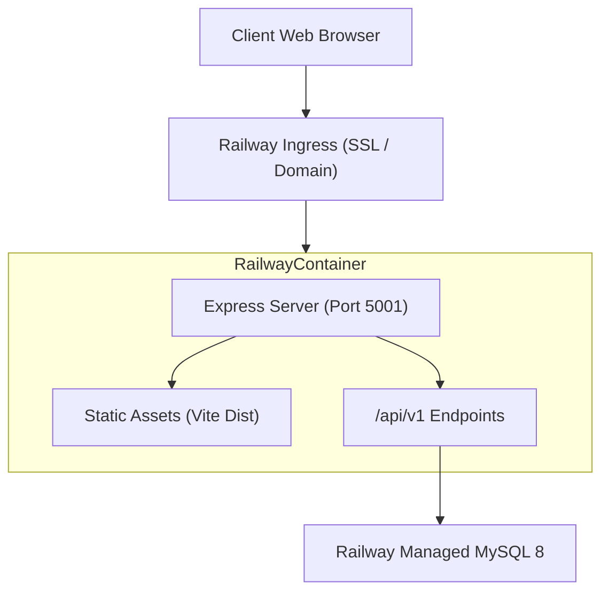
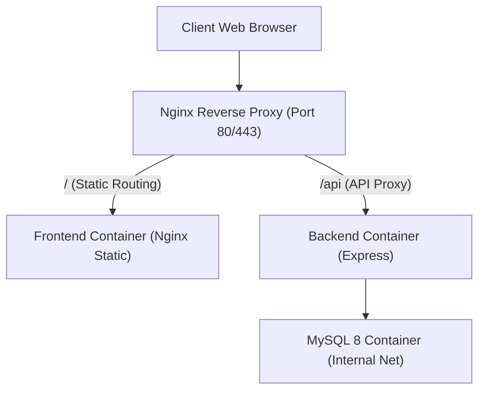

# 09. Project Structure & Docker Architecture Document

**Project Name:** Personal Income & Expense Management System (ระบบจัดการรายรับ-รายจ่ายส่วนบุคคล)  
**Document Version:** 1.0.0  
**Phase:** Phase 2 - Project Structure & DevOps Architecture Specification  
**Authors:** Senior Software Architect, DevOps Architect & Project Manager  

---

## 1. Project Context & Purpose
เอกสารฉบับนี้เป็นการกำหนดโครงสร้างไดเรกทอรีโปรเจกต์ (Project Structure), สถาปัตยกรรมคอนเทนเนอร์ (Docker Architecture) และกลยุทธ์การปรับใช้ระบบบนสภาพแวดล้อมจริง (Deployment Strategy) สำหรับ **Personal Income & Expense Management System**

ระบบออกแบบให้รองรับทั้งสภาพแวดล้อมการพัฒนา (Development Environment) ผ่าน Docker Compose และสภาพแวดล้อมจริง (Production Environment) 2 รูปแบบหลัก คือ **Target A: Railway Deployment** (Single-container Multi-stage โดยไม่ใช้ Nginx) และ **Target B: On-Premise / Ubuntu Deployment** (Multi-container ร่วมกับ Nginx Reverse Proxy)

---

## 2. Tech Stack & Environment Boundaries

* **Frontend:** React 18 + Vite 5 + MUI 5
* **Backend:** Node.js 20 LTS + Express 4 (Entry point: `backend/src/server.js`)
* **Database:** MySQL 8.0 (Init script path: `db/init/01-init.sql`)
* **Development Orchestration:** Docker Compose (Dev) + phpMyAdmin
* **Production Targets:**
  - **Target A (Primary):** Railway Cloud Platform (Single-container Multi-stage Dockerfile)
  - **Target B (Alternative):** On-Premise / Ubuntu VPS (`docker-compose.prod.yml` + Nginx Reverse Proxy)

---

## 3. Mandatory Development Port Allocation

การกำหนด Port บนเครื่อง Host และ Container ต้องปฏิบัติตามตารางนี้อย่างเด็ดขาด:

| Service Name | Host Port | Container Port | Purpose & Description |
| :--- | :---: | :---: | :--- |
| **`frontend`** | `5173` | `5173` | React + Vite Dev Server (Hot Reload HMR) |
| **`backend`** | `5001` | `5001` | Express API Server (หลีกเลี่ยง Port 5000 เนื่องจากชนกับ macOS AirPlay Receiver) |
| **`db`** | `3307` | `3306` | MySQL 8.0 Database Engine (Host Port 3307 ป้องกันชนกับ MySQL เดิมบนเครื่อง) |
| **`phpmyadmin`** | `8081` | `80` | MySQL Database Management Web GUI (`platform: linux/amd64` สำหรับ Apple Silicon) |

---

## 4. Production Deployment Targets Architecture

### 4.1 Target A: Railway Cloud Deployment (Primary Target)
* **Strategy:** Single-container Architecture จาก Root `Dockerfile` แบบ Multi-stage
* **Workflow & Data Flow:**



* **ลักษณะสำคัญ:**
  - ใช้ Root `Dockerfile` สร้าง Frontend Dist และนำไปป้อนให้ Express Serve เป็น Static Files ร่วมกับ API ภายใน Container เดียว
  - Railway เป็นผู้ดูแล SSL/TLS Certificate และ Custom Domain ให้โดยอัตโนมัติ **โดยไม่ใช้ Nginx แยก Container**
  - มีไฟล์ `railway.toml` กำหนดค่า Build และ Healthcheck Parameters

### 4.2 Target B: On-Premise / Ubuntu VPS Deployment (Alternative Target)
* **Strategy:** Multi-container Architecture ด้วย `docker-compose.prod.yml` ร่วมกับ Nginx Reverse Proxy
* **Workflow & Data Flow:**



* **ลักษณะสำคัญ:**
  - มีไฟล์ `nginx/default.conf` ทำหน้าที่ยิง Route `/api` ไปยัง Backend และส่วนที่เหลือไปยัง Frontend Static Container
  - เหมาะสำหรับนำไปวางบน Server ขององค์กร หรือ Ubuntu VPS ทั่วไป

---

## 5. Repository Mandatory Constraints & Conventions

เพื่อความถูกต้องตามสเปกของโปรเจกต์ ต้องรักษากฎต่อไปนี้อย่างเคร่งครัด:

1. **Database Directory Constraint:** 
   - ต้องใช้ไดเรกทอรี `db/init/` สำหรับเก็บสคริปต์ SQL ตั้งต้น (`01-init.sql`) **ห้ามใช้ `database/`**
   - Docker Compose Development ต้อง Mount `./db/init/` ไปยัง `/docker-entrypoint-initdb.d` แบบ Read-only (`:ro`)
2. **Backend Entry Point Constraint:**
   - Entry point หลักของ Backend คือ **`backend/src/server.js`**
   - **ห้ามเปลี่ยนเป็น `backend/server.js` หรือ `backend/src/index.js`**
3. **Docker Compose Syntax Constraint:**
   - **ห้ามใส่ attribute `version`** ใน `docker-compose.yml` และ `docker-compose.prod.yml`
4. **Internal Network Host Name Constraint:**
   - การสื่อสารภายใน Docker Network ระหว่าง Backend และ Database ต้องอ้างอิงชื่อ Service **`db`** และ Internal Port **`3306`** (ห้ามใช้ `localhost` หรือ `127.0.0.1`)

---

## 6. Complete Project Directory Structure (โครงสร้างไดเรกทอรีโปรเจกต์)

```text
PIEM_System/
├── .env.example                    # แม่แบบตัวแปรสภาพแวดล้อม (Local & Dev)
├── .env                            # ตัวแปรสภาพแวดล้อมจริง (Git Ignored)
├── .gitignore                      # กฎการละเว้นไฟล์สำหรับ Git
├── README.md                       # เอกสารคำแนะนำโปรเจกต์หลัก
├── Dockerfile                      # Root Multi-stage Dockerfile สำหรับ Railway Production
├── docker-compose.yml              # Local Development Orchestration (Vite, Nodemon, MySQL, phpMyAdmin)
├── docker-compose.prod.yml         # On-Premise Production Orchestration (Nginx, Express, MySQL)
├── railway.toml                    # คอนฟิกการ Build & Healthcheck สำหรับ Railway
├── docs/                           # ไดเรกทอรีเอกสารทั้งหมด
│   └── planning/                   # เอกสารวางแผนและสถาปัตยกรรม (00-10)
│       ├── 00-tech-stack-decision.md
│       ├── 00-ai-working-rules.md
│       ├── 00-documentation-structure.md
│       ├── 00-git-workflow.md
│       ├── 00-readiness-check.md
│       ├── 01-system-overview.md
│       ├── 02-requirements.md
│       ├── 03-roles-permissions.md
│       ├── 04-transaction-workflow.md
│       ├── 05-database-design.md
│       ├── 06-api-contract.md
│       ├── 07-frontend-pages.md
│       ├── 08-dashboard-report-notification.md
│       └── 09-project-docker-architecture.md
├── db/                             # ไดเรกทอรีฐานข้อมูล
│   └── init/                       # สคริปต์เริ่มต้นฐานข้อมูล (Mandatory Path)
│       └── 01-init.sql             # SQL DDL & Seed Categories
├── nginx/                          # คอนฟิก Nginx สำหรับ On-Premise Target B
│   └── default.conf                # Nginx Reverse Proxy Config
├── backend/                        # ซอร์สโค้ดฝั่ง Backend (Node.js + Express)
│   ├── Dockerfile.dev              # Development Dockerfile (Nodemon)
│   ├── package.json                # Backend Dependencies (express, mysql2, cors, dotenv)
│   └── src/
│       ├── server.js               # Backend Entry Point (Mandatory Path)
│       ├── config/                 # DB Connection Pool Config
│       │   └── db.js
│       ├── controllers/            # API Route Logic Controllers
│       ├── middleware/             # Auth & Error Handling Middlewares
│       └── routes/                 # Express API Router Declarations
└── frontend/                       # ซอร์สโค้ดฝั่ง Frontend (React 18 + Vite 5 + MUI 5)
    ├── Dockerfile.dev              # Development Dockerfile (Vite Dev Server)
    ├── package.json                # Frontend Dependencies (react, vite, @mui/material)
    ├── vite.config.js              # Vite Host & API Proxy Configuration
    ├── index.html                  # HTML Shell Entrypoint
    └── src/
        ├── main.jsx                # React App Entrypoint
        ├── App.jsx                 # Main Application Layout
        ├── components/             # Reusable UI Components
        ├── pages/                  # Page Views (Dashboard, Transactions, Reports, Profile)
        └── services/               # Axios API Service Layer
```

---

## 7. Development Docker Architecture (`docker-compose.yml`)

### 7.1 Development Services Summary

```yaml
# Conceptual Development Compose Structure (No version attribute)
services:
  db:
    image: mysql:8.0
    container_name: piem_mysql
    restart: always
    environment:
      MYSQL_ROOT_PASSWORD: ${MYSQL_ROOT_PASSWORD}
      MYSQL_DATABASE: ${MYSQL_DATABASE}
      MYSQL_USER: ${MYSQL_USER}
      MYSQL_PASSWORD: ${MYSQL_PASSWORD}
    ports:
      - "3307:3306"
    volumes:
      - db_data:/var/lib/mysql
      - ./db/init/01-init.sql:/docker-entrypoint-initdb.d/01-init.sql:ro
    healthcheck:
      test: ["CMD", "mysqladmin", "ping", "-h", "localhost", "-u", "root", "-p${MYSQL_ROOT_PASSWORD}"]
      interval: 10s
      timeout: 5s
      retries: 5
      start_period: 10s
    networks:
      - piem_net

  phpmyadmin:
    image: phpmyadmin/phpmyadmin
    container_name: piem_phpmyadmin
    platform: linux/amd64 # สำหรับ Apple Silicon M1-M4
    ports:
      - "8081:80"
    environment:
      PMA_HOST: db
      PMA_PORT: 3306
    depends_on:
      db:
        condition: service_healthy
    networks:
      - piem_net

  backend:
    build:
      context: ./backend
      dockerfile: Dockerfile.dev
    container_name: piem_backend
    ports:
      - "5001:5001"
    environment:
      PORT: 5001
      DB_HOST: db
      DB_PORT: 3306
    volumes:
      - ./backend:/app
      - /app/node_modules # Anonymous Volume ป้องกัน Host Overwrite
    depends_on:
      db:
        condition: service_healthy
    networks:
      - piem_net

  frontend:
    build:
      context: ./frontend
      dockerfile: Dockerfile.dev
    container_name: piem_frontend
    ports:
      - "5173:5173"
    volumes:
      - ./frontend:/app
      - /app/node_modules # Anonymous Volume
    depends_on:
      - backend
    networks:
      - piem_net

networks:
  piem_net:
    driver: bridge

volumes:
  db_data:
```

---

## 8. Target A: Railway Multi-Stage Build Architecture (`Dockerfile`)

### 8.1 Conceptual Root Dockerfile Workflow

```dockerfile
# Stage 1: Build Frontend Assets
FROM node:20-alpine AS frontend-builder
WORKDIR /app/frontend
COPY frontend/package*.json ./
RUN npm install
COPY frontend/ ./
RUN npm run build

# Stage 2: Production Server Runner
FROM node:20-alpine AS runner
WORKDIR /app

# Copy Backend Dependencies & Source
COPY backend/package*.json ./
RUN npm install --production
COPY backend/ ./

# Copy Static Frontend Dist from Stage 1 into Express Public Directory
COPY --from=frontend-builder /app/frontend/dist ./public

EXPOSE 5001
CMD ["node", "src/server.js"]
```

---

## 9. Environment Variable Strategy

* **Local Environment (`.env`):**
  ```env
  MYSQL_ROOT_PASSWORD=rootpassword
  MYSQL_DATABASE=piem_db
  MYSQL_USER=piem_user
  MYSQL_PASSWORD=piem_password
  MYSQL_HOST_PORT=3307
  BACKEND_PORT=5001
  FRONTEND_PORT=5173
  PHPMYADMIN_PORT=8081
  DB_HOST=db
  DB_PORT=3306
  ```
* **Production Variables (Railway Dashboard):** กำหนดค่า Credentials และ Database Connection Strings โดยตรงผ่าน Railway Environment Panel โดยห้ามใส่รหัสผ่านจริงไว้ในซอร์สโค้ด

---

## 10. Open Questions & Assumptions

### Assumptions
1. สคริปต์เริ่มต้นฐานข้อมูลใน `db/init/01-init.sql` จะสร้างตาราง `users`, `categories`, `transactions`, `audit_logs` พร้อมข้อมูล Seed หมวดหมู่มาตรฐานโดยอัตโนมัติเมื่อสั่งรันครั้งแรก

### Open Questions
> [!IMPORTANT]
> 1. **Railway External Database:** บน Railway จะใช้ Railway MySQL Plugin หรือใช้ External Managed Database Instance ในการเชื่อมต่อ? (สถาปัตยกรรมปัจจุบันรองรับทั้งสองแบบผ่าน `DB_HOST`)

---

## 11. Recommendations
1. **Directory Consistency:** ตรวจสอบโครงสร้างโฟลเดอร์ให้ตรงตามสเปก โดยเฉพาะ `db/init/01-init.sql` และ `backend/src/server.js` ก่อนเริ่มขั้นตอน Implementation
2. **Rebuild Alert Rule:** เมื่อมีการอัปเดตไฟล์ `package.json` ต้องสั่ง Rebuild Docker Container (`docker compose up -d --build`) เสมอ
